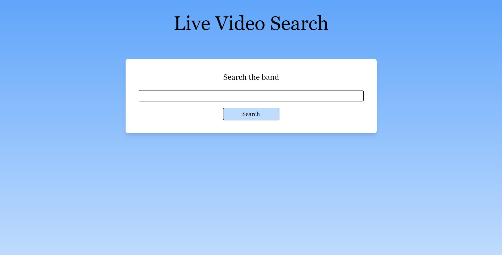
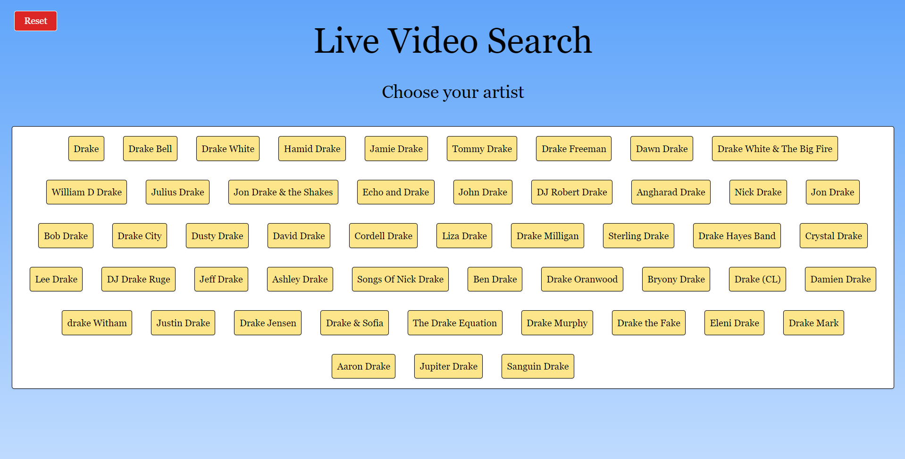
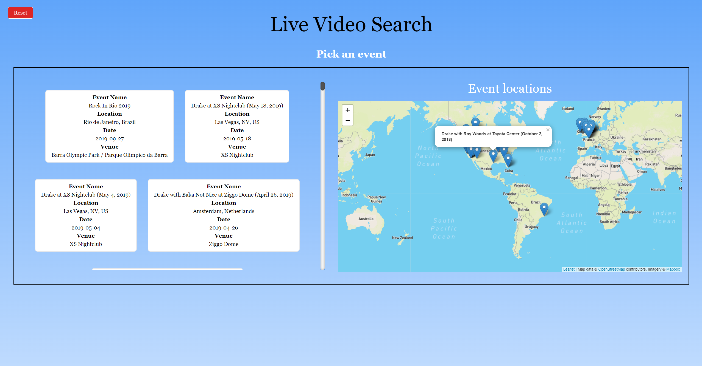
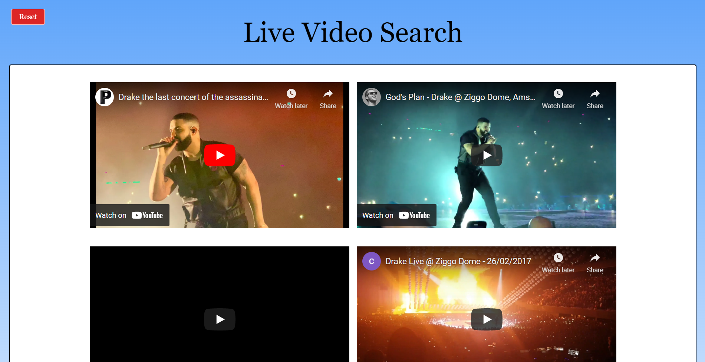

# Live Video Search
This application was developed for the Cloud Computing unit at QUT.

## About
This application is a single page lightweight application that combines multiple API services to bring a rich user experience.

The application allows a user to search for band/artist and receive information about their past events, see where those events are located on an interactive map, and from there they can choose an event to receive live videos from YouTube of the event. 

## Mashup
This application had to be a mashup of multiple public API's that when combined enrich the user expereience.

This application uses the, 

Songkick API,
Google API (Youtube Search),
Leaflet JS (Mapbox). 

## Hosted on the cloud
The second half of the assignment was to user docker and containerise the application and host it on a AWS EC2 instance (See report for details of docker/deployment).

